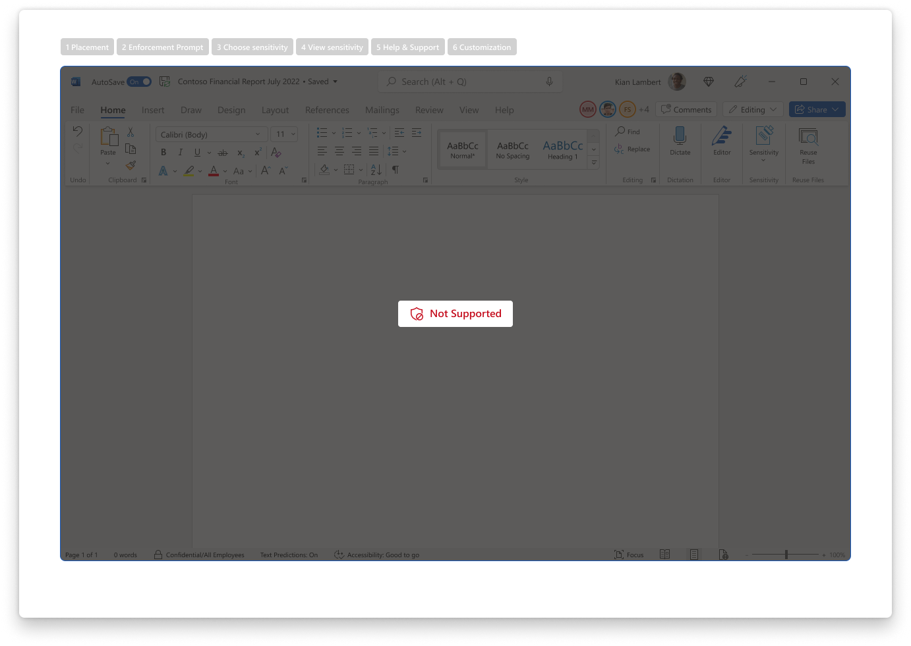
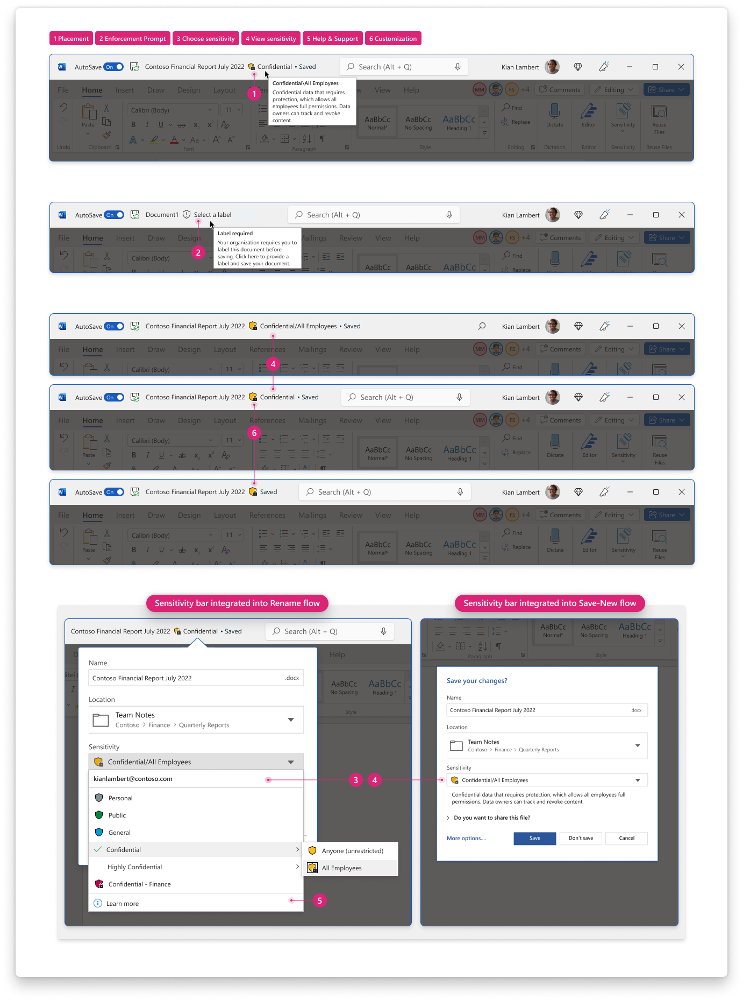

 
[`➡️ Get Started`](../../GetStarted.md) > [`➡️ Step 1`](../../AIP2MIPStep1.md) > [`➡️ Step 2`](../../AIP2MIPStep2.md) > [`➡️ Step 3`](../../AIP2MIPStep3.md) > [`➡️ Step 4`](../../AIP2MIPStep4.md)[***`Change Guide`***](../../CompareAIP2MIP.md) > [`➡️ Step 5`](../../AIP2MIPStep5.md)

# `User Interface` / `Sensitivity Bar`

The sensitivity bar offers a second method of viewing or applying sensitivity labels and provides a more prominent experience that's easier for users to recognize and use. See [Sensitivity Menu](SensitivityMenu.md) for the primary method for applying labels.

## Product Capabilities
The table below lists the main characteristics of this feature and its comparison across the AIP Add-in vs. the built-in labeling solution. These are mapped to product screenshots in the next section. 

| Use Case  | :simple-microsoftazure: Add-In :material-download: [`Latest`](AIPLatest)| :material-microsoft-office: Built-In :material-cloud-download: [`Current Channel`](MIPLatest) | :material-microsoft-office: Built-In :material-calendar-clock: `Coming Soon` |
| :---- | :---- | :---- | :---- |
| :material-numeric-1-circle:{ .num  } **Placement**  How is the scenario surfaced to end users? | :material-shield-check:{ .success } `Supported` Appears as custom bar below the ribbon.  |  :material-shield-off-outline:{ .notsupported } `Not Supported` | :material-calendar-star:{ .preview } `In Preview` Sensitivity bar embedded alongside content name, such as file name for documents or subject for emails. Integrated directly into workflows affecting document's security boundary, such as saving, renaming, moving a file within Office.  :material-calendar-clock:{ .planning } `In Planning` Sensitivity bar added into Export, Print, Share scenarios, ensuring users are never more than 1-click away from their content's security setting. |
| :material-numeric-2-circle:{ .num  } **Enforcement Prompt**  How are end-users prompted to comply with their labeling policy? | :material-shield-check:{ .success } `Supported` When label is missing shows "not set". |  :material-shield-off-outline:{ .notsupported } `Not Supported` | :material-calendar-star:{ .preview } `In Preview` Dynamic prompt that updates according to enforcement policy. When labels are optional, shows "no label". When labels required, shows "select a label". Iconography updates accordingly for an added call-to-action element. |
| :material-numeric-3-circle:{ .num  } **Choose sensitivity**  How do users interact with this to select or change sensitivity labels? | :material-shield-check:{ .success } `Supported`  |  :material-shield-off-outline:{ .notsupported } `Not Supported` | :material-calendar-star:{ .preview } `In Preview` Sensitivity menu is embedded within sensitivity bar, providing consistent label-selection experience from anywhere. See Sensitivity Menu for more information. |
| :material-numeric-4-circle:{ .num  } **View sensitivity**  How is content's assigned sensitivity surfaced to users? | :material-shield-check:{ .success } `Supported`  |  :material-shield-off-outline:{ .notsupported } `Not Supported` | :material-calendar-star:{ .preview } `In Preview` Dynamic label indicator that shows the assigned label's name (and sublabel), color, and encryption status. For labels with sublabels, the sublabel is hidden dynamically after a short delay to give users more space for their document title after they've had the opportunity to view the full label name. Full label is always shown when a document is opened or when a label is changed. Label description is available from tooltips and shown inline below the selected label when saving or renaming files. |
| :material-numeric-5-circle:{ .num  } **Help and Feedback**  Can users access organization-specific help and support information? | :material-shield-off-outline:{ .notsupported } `Not Supported` Only available from ribbon [Sensitivity Menu](SensitivityMenu.md).  |  :material-shield-off-outline:{ .notsupported } `Not Supported` | :material-calendar-star:{ .preview } `In Preview` Supported from within sensitivity menu that's embedded into the sensitivity bar. |
| :material-numeric-6-circle:{ .num  } **Customizations**  Can users or admins customize this experience? | :material-shield-check:{ .success } `Supported`  |  :material-shield-off-outline:{ .notsupported } `Not Supported` | :material-calendar-star:{ .preview } `In Preview` Admins can configure whether the full sensitivity bar is shown alongside the content name, or just the icon indicator showing the label color and encryption status. See tip below for more information. |
| :material-numeric-7-circle:{ .num  } **Localization**  How are label names and descriptions surfaced to users who choose a display language for Office? | :material-shield-check:{ .success } `Supported` See [Sensitivity Menu](SensitivityMenu.md) |  :material-shield-check:{ .success } `Supported` See [Sensitivity Menu](SensitivityMenu.md) | :material-shield-check:{ .success } `No change` |
| ~~~~~~~~~~~~~~~~ | ~~~~~~~~~~~~~~~ | ~~~~~~~~~~~~~~~ | ~~~~~~~~~~~~~~~ |

### Change Management Notes

!!! tip

    Although the new sensitivity bar for built-in labels uses less space than the add-in in editing view, it's available in more scenarios across the document lifecycle. 
    Users with the new sensitivity bar can view and apply labels when saving a new document for the first time, renaming an existing file, or when using the File menu for additional document actions. 
    Learn more about these [contextual sensitivity bars from the Office Insiders Blog](https://insider.office.com/en-us/blog/sensitivity-bar-in-office-for-windows).

!!! tip

    To help users stay focused on their content while ensuring that they recognize the sensitivity of their documents, 
    the label in the sensitivity bar hides the sublabel after a short delay when opening the file or changing labels. 
    The parent label, or labels without sublabels, are always shown with their respective label color and encryption status. 
    The full label name is shown in a tooltip or when using the sensitivity bar to change labels.

## Product Screenshots

Use the screenshots below to help you evaluate the visual changes that correspond to the numbered use cases above. 

=== "Add-In :material-download:`Latest`"

    

=== "Built-In :material-cloud-download:`Current Channel`"

    

=== "Built-In :material-calendar-clock: `Coming Soon`"

    

    
## Learn More

:material-help-circle:  [Learn more about Sensitivity Bar](SCCToolbar)

:material-help-circle:  [Configure a label color](SCCColors)

:material-help-circle:  [End-User Support](IWToolbar)

:material-help-circle:  [Office Insiders Blog](IWBlog)

<!-- ============ LINKS =========== -->

[AIPLatest]: https://learn.microsoft.com/en-us/azure/information-protection/rms-client/unifiedlabelingclient-version-release-history
[MIPLatest]: https://learn.microsoft.com/en-us/microsoft-365/compliance/sensitivity-labels-office-apps#support-for-sensitivity-label-capabilities-in-apps

[SCCToolbar]: https://learn.microsoft.com/en-us/microsoft-365/compliance/sensitivity-labels-office-apps?view=o365-worldwide#sensitivity-bar
[SCCColors]: https://learn.microsoft.com/en-us/microsoft-365/compliance/sensitivity-labels-office-apps?view=o365-worldwide#label-colors
[IWToolbar]: https://support.microsoft.com/en-us/office/apply-sensitivity-labels-to-your-files-and-email-in-office-2f96e7cd-d5a4-403b-8bd7-4cc636bae0f9
[IWBlog]: https://insider.office.com/blog/sensitivity-bar-in-office-for-windows
